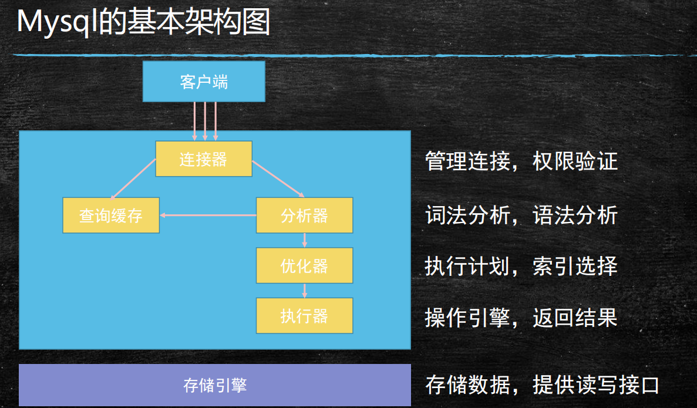

## Mysql

[从头学mysql](https://blog.csdn.net/yanluandai1985/article/details/89632265)

### mysql安装

[windows下安装](https://www.cnblogs.com/zhangkanghui/p/9613844.html)

* 官网(https://dev.mysql.com/downloads/mysql/)

### 概念

**维基百科:**

```scss
MySQL原本是一个开放源码的关系数据库管理系统，原开发者为瑞典的MySQL AB公司，该公司于2008年被昇阳微系统（Sun Microsystems）收购。2009年，甲骨文公司（Oracle）收购昇阳微系统公司，MySQL成为Oracle旗下产品。
MySQL在过去由于 性能高、成本低、可靠性好，已经成为最流行的开源数据库，因此被广泛地应用在Internet上的中小型网站中。随着MySQL的不断成熟，它也逐渐用于更多大规模网站和应用
但被甲骨文公司收购后，Oracle大幅调涨MySQL商业版的售价，且甲骨文公司不再支持另一个自由软件项目OpenSolaris的发展，因此导致自由软件社群们对于Oracle是否还会持续支持 MySQL社群版（MySQL之中唯一的免费版本 有所隐忧，MySQL的创始人麦克尔·维德纽斯以MySQL为基础，成立分支计划MariaDB。而原先一些使用MySQL的开源软件逐渐转向MariaDB或其它的数据库
```

>数据定义语言DDL
>
>数据操纵语言DML
>
>数据查询语言DQL
>
>数据控制语言DCL

### mysql架构

[]()



### linux中主主搭建

>2台主主

####主主搭建

#### 删除干净

```shell
rpm -qa | grep mysql
rpm -qa | grep mariadb
rm -rf /etc/my.cnf
rm -rf /etc/init.d/mysqld
whereis mysql
vi /etc/rc.d/rc.local
## /etc/init.d/mysqld start
##
vi /root/.bash_profile
source /root/.bash_profile 
```


#####解压版

```shell
##安装前，我们可以检测系统是否自带安装 MySQL:
rpm -qa | grep mysql
rpm -e mysql-community-server-5.7.28-1.el7.x86_64　## 普通删除模式
rpm -e --nodeps mysql-community-common-5.7.28-1.el7.x86_64
rpm -e --nodeps mysql-community-client-5.7.28-1.el7.x86_64
rpm -e --nodeps mysql-community-libs-5.7.28-1.el7.x86_64
whereis mysql
##检查否存在 mariadb 数据库，如有，卸载之，卸载同上
rpm -qa | grep mariadb
rpm -e --nodeps mariadb-libs-5.5.56-2.el7.x86_64
## 删除解压版
yum remove  mysql mysql-server mysql-libs mysql-server;
find / -name mysql 将找到的相关东西delete掉；
rpm -qa|grep mysql(查询出来的东东yum remove掉)
## 日志路径
## 解压版安装
mkdir -p /usr/local/mysql     
cd /usr/local
tar -xvf mysql-5.7.28-1.el7.x86_64.rpm-bundle.tar
mv mysql-5.7.28-1.el7.x86_64.rpm-bundle.tar mysql
## 先检查是否有mysql用户组和mysql用户,没有就添加有就忽略：
groups mysql
##MySQL 组和用户
groupadd mysql
useradd -g mysql -s /sbin/nologin mysql
## 更改mysql目录下所有的目录及文件夹所属的用户组和用户，以及权限
chown -R mysql:mysql /usr/local/mysql
##chmod -R 755 /usr/local/java/mysql
cd /usr/local/mysql/support-files/
cp mysql.server  /etc/init.d/mysqld
chmod +x /etc/init.d/mysqld             # 添加执行权限
vi /etc/rc.d/rc.local
添加 /etc/init.d/mysqld start
## 设置变量
vi /root/.bash_profile
PATH=$PATH:$HOME/bin:/usr/local/mysql/bin:/usr/local/mysql/lib
source /root/.bash_profile
## 修改密码
mysqladmin -u root password 密码
## 修改端口xx
```

##### rpm方式

[rpm方式安装](https://www.cnblogs.com/wy-ls/p/8916722.html)

>```
>cp /usr/share/mysql/my-default.cnf /etc/my.cnf    (5.6)
>```
>
>

```shell
## 先卸载,如上
cd /usr/local/mysqlrpm
tar -xvf mysql-5.7.28-1.el7.x86_64.rpm-bundle.tar
##
rpm -ivh mysql-community-common-5.7.28-1.el7.x86_64.rpm
rpm -ivh mysql-community-libs-5.7.28-1.el7.x86_64.rpm
rpm -ivh mysql-community-client-5.7.28-1.el7.x86_64.rpm
rpm -ivh mysql-community-server-5.7.28-1.el7.x86_64.rpm
##	
systemctl restart mysqld.service
systemctl start mysqld.service
systemctl stop mysqld.service
## 临时密码
grep "password" /var/log/mysqld.log
##
mysql -uroot -p
.%Yfp>2PdQTu
Wm8?_Ky*?jGn
## 修改密码
set global validate_password_policy=0;
set global validate_password_length=1;
ALTER USER 'root'@'localhost' IDENTIFIED BY 'mvtech!123';
## 修改远程访问资源
grant all privileges on *.* to 'root'@'%' identified by '123456' with grant option;
flush privileges;
## 设置字符集
vi /etc/my.cnf
#在[mysqld]部分添加：
character-set-server=utf8
#在文件末尾新增[client]段，并在[client]段添加：
default-character-set=utf8
```

##### 配置

```shell
##
stop slave;
start slave;
## 1
server-id=1
log-bin=mysql-bin
sync_binlog=1
binlog_checksum=none
binlog_format=mixed
auto-increment-increment=2
auto-increment-offset=1
slave-skip-errors=all
replicate-ignore-db=mysql
replicate-ignore-db=informaton_schema
replicate-ignore-db=performance_schema
replicate-ignore-db=sys
expire_logs_days=7
## 2
server-id=2
log-bin=mysql-bin
sync_binlog=1
binlog_checksum=none
binlog_format=mixed
auto-increment-increment=2
auto-increment-offset=2
slave-skip-errors=all
replicate-ignore-db=mysql
replicate-ignore-db=informaton_schema
replicate-ignore-db=performance_schema
replicate-ignore-db=sys
expire_logs_days=7
## 进入hainan-01 创建repl账号，专门给hainan-02使用
grant replication slave,replication client on *.* to repl@'192.168.73.139' identified by 'Mvtech@123';
## 进入hainan-02 创建repl账号，专门给hainan-01使用
grant replication slave,replication client on *.* to repl@'192.168.73.138' identified by 'Mvtech@123';

## hainan-01 138
show master status;
change  master to master_host='192.168.73.139',master_user='repl',master_password='Mvtech@123',master_log_file='mysql-bin.000001',master_log_pos=612;

## hainan-01 139
show master status;
change  master to master_host='192.168.73.138',master_user='repl',master_password='Mvtech@123',master_log_file='mysql-bin.000001',master_log_pos=150;

## start slave;
```


#### mysql配置相关

```shell
 show variables like "log%";
```


### 库操作

```mysql
-- 查看当前数据库
    SELECT DATABASE();
-- 显示当前时间、用户名、数据库版本
    SELECT now(), user(), version();
-- 创建库
    CREATE DATABASE[ IF NOT EXISTS] 数据库名 数据库选项
    数据库选项：
  	默认字符集为 CHARACTER SET charset_name
    默认校对规则为  COLLATE collation_name  
   举例子:
   CREATE DATABASE IF NOT EXISTS shop CHARACTER SET utf8;
-- 查看已有库
    SHOW DATABASES like test
-- 查看当前库信息
    SHOW CREATE DATABASE 数据库名
-- 修改库的选项信息
    ALTER DATABASE 库名 选项信息
-- 删除库
    DROP DATABASE[ IF EXISTS] 数据库名
        同时删除该数据库相关的目录及其目录内容
-- 
	DROP DATABASE  IF EXISTS test2;
-- 举个栗子
drop database  if exists db1;
create database db1 charset utf8;
show databases; //查看
use db1;  //进入	
```

#### 字符编码

```mysql
/* 字符集编码 */ ------------------
-- MySQL、数据库、表、字段均可设置编码
-- 数据编码与客户端编码不需一致
SHOW VARIABLES LIKE 'character_set_%'   -- 查看所有字符集编码项
    character_set_client        客户端向服务器发送数据时使用的编码
    character_set_results       服务器端将结果返回给客户端所使用的编码
    character_set_connection    连接层编码
SET 变量名 = 变量值
    SET character_set_client = gbk;
    SET character_set_results = gbk;
    SET character_set_connection = gbk;
SET NAMES GBK;  -- 相当于完成以上三个设置
-- 校对集
    校对集用以排序
    SHOW CHARACTER SET [LIKE 'pattern']/SHOW CHARSET [LIKE 'pattern']   查看所有字符集
    SHOW COLLATION [LIKE 'pattern']     查看所有校对集
    CHARSET 字符集编码     设置字符集编码
    COLLATE 校对集编码     设置校对集编码
```

### 表操作

```mysql
-- 创建表
    CREATE [TEMPORARY] TABLE[ IF NOT EXISTS] [库名.]表名 ( 表的结构定义 )[ 表选项]
        每个字段必须有数据类型
        最后一个字段后不能有逗号
        TEMPORARY 临时表，会话结束时表自动消失
        对于字段的定义：
            字段名 数据类型 [NOT NULL | NULL] [DEFAULT default_value] [AUTO_INCREMENT] [UNIQUE [KEY] | [PRIMARY] KEY] [COMMENT 'string']
-- 表选项
    -- 字符集
        CHARSET = charset_name
        如果表没有设定，则使用数据库字符集
    -- 存储引擎
        ENGINE = engine_name
        表在管理数据时采用的不同的数据结构，结构不同会导致处理方式、提供的特性操作等不同
        常见的引擎：InnoDB MyISAM Memory/Heap BDB Merge Example CSV MaxDB Archive
        不同的引擎在保存表的结构和数据时采用不同的方式
        MyISAM表文件含义：.frm表定义，.MYD表数据，.MYI表索引
        InnoDB表文件含义：.frm表定义，表空间数据和日志文件
        SHOW ENGINES -- 显示存储引擎的状态信息
        SHOW ENGINE 引擎名 {LOGS|STATUS} -- 显示存储引擎的日志或状态信息
    -- 自增起始数
    	AUTO_INCREMENT = 行数
    -- 数据文件目录
        DATA DIRECTORY = '目录'
    -- 索引文件目录
        INDEX DIRECTORY = '目录'
    -- 表注释
        COMMENT = 'string'
    -- 分区选项
        PARTITION BY ... (详细见手册)
-- 查看所有表
    SHOW TABLES[ LIKE 'pattern']
    SHOW TABLES FROM  库名
-- 查看表结构
    SHOW CREATE TABLE 表名 （信息更详细）
    DESC 表名 / DESCRIBE 表名 / EXPLAIN 表名 / SHOW COLUMNS FROM 表名 [LIKE 'PATTERN']
    SHOW TABLE STATUS [FROM db_name] [LIKE 'pattern']
-- 修改表
    -- 修改表本身的选项
        ALTER TABLE 表名 表的选项
        eg: ALTER TABLE 表名 ENGINE=MYISAM;
    -- 对表进行重命名
        RENAME TABLE 原表名 TO 新表名
        RENAME TABLE 原表名 TO 库名.表名 （可将表移动到另一个数据库）
        -- RENAME可以交换两个表名   
-- 删除表
    DROP TABLE[ IF EXISTS] 表名 ...
-- 清空表数据
    TRUNCATE [TABLE] 表名
-- 复制表结构
    CREATE TABLE 表名 LIKE 要复制的表名
-- 复制表结构和数据
    CREATE TABLE 表名 [AS] SELECT * FROM 要复制的表名
-- 检查表是否有错误
    CHECK TABLE tbl_name [, tbl_name] ... [option] ...
-- 优化表
    OPTIMIZE [LOCAL | NO_WRITE_TO_BINLOG] TABLE tbl_name [, tbl_name] ...
-- 修复表
    REPAIR [LOCAL | NO_WRITE_TO_BINLOG] TABLE tbl_name [, tbl_name] ... [QUICK] [EXTENDED] [USE_FRM]
-- 分析表
    ANALYZE [LOCAL | NO_WRITE_TO_BINLOG] TABLE tbl_name [, tbl_name] ...
-- 例如:
CREATE TABLE `huanyu_user` (
  `id` int(11) NOT NULL AUTO_INCREMENT,
  `user_name` varchar(50) DEFAULT NULL COMMENT '用户名',
  `password` varchar(150) DEFAULT NULL COMMENT '密码',
  `email` varchar(100) DEFAULT NULL COMMENT '邮箱',
  `mobile` varchar(20) DEFAULT NULL COMMENT '电话',
  `insert_time` datetime DEFAULT NULL COMMENT '插入时间',
  `update_time` datetime DEFAULT NULL COMMENT '更新时间',
  `insert_user_id` date DEFAULT NULL COMMENT '添加人id',
  `update_user_id` date DEFAULT NULL COMMENT '更新人id',
  PRIMARY KEY (`id`)
) ENGINE=InnoDB AUTO_INCREMENT=10 DEFAULT CHARSET=utf8mb4 COMMENT='用户表';

```

#### 建表规范

[建表规范和注意事项](https://blog.csdn.net/w384694051/article/details/76998112)

[建表规范和注意事项2](https://www.cnblogs.com/zjfjava/p/6920407.html)

```
/* 建表规范 */ ------------------
    -- Normal Format, NF
        - 每个表保存一个实体信息
        - 每个具有一个ID字段作为主键
        - ID主键 + 原子表
    -- 1NF, 第一范式
        字段不能再分，就满足第一范式。
    -- 2NF, 第二范式
        满足第一范式的前提下，不能出现部分依赖。
        消除复合主键就可以避免部分依赖。增加单列关键字。
    -- 3NF, 第三范式
        满足第二范式的前提下，不能出现传递依赖。
        某个字段依赖于主键，而有其他字段依赖于该字段。这就是传递依赖。
        将一个实体信息的数据放在一个表内实现。
```

####数据类型

```mysql
/* 列属性（列约束） */ ------------------
1. PRIMARY 主键
    - 能唯一标识记录的字段，可以作为主键。
    - 一个表只能有一个主键。
    - 主键具有唯一性。
    - 声明字段时，用 primary key 标识。
        也可以在字段列表之后声明
            例：create table tab ( id int, stu varchar(10), primary key (id));
    - 主键字段的值不能为null。
    - 主键可以由多个字段共同组成。此时需要在字段列表后声明的方法。
        例：create table tab ( id int, stu varchar(10), age int, primary key (stu, age));
2. UNIQUE 唯一索引（唯一约束）
    使得某字段的值也不能重复。
3. NULL 约束
    null不是数据类型，是列的一个属性。
    表示当前列是否可以为null，表示什么都没有。
    null, 允许为空。默认。
    not null, 不允许为空。
    insert into tab values (null, 'val');
        -- 此时表示将第一个字段的值设为null, 取决于该字段是否允许为null
4. DEFAULT 默认值属性
    当前字段的默认值。
    insert into tab values (default, 'val');    -- 此时表示强制使用默认值。
    create table tab ( add_time timestamp default current_timestamp );
        -- 表示将当前时间的时间戳设为默认值。
        current_date, current_time
5. AUTO_INCREMENT 自动增长约束
    自动增长必须为索引（主键或unique）
    只能存在一个字段为自动增长。
    默认为1开始自动增长。可以通过表属性 auto_increment = x进行设置，或 alter table tbl auto_increment = x;
6. COMMENT 注释
    例：create table tab ( id int ) comment '注释内容';
7. FOREIGN KEY 外键约束
    用于限制主表与从表数据完整性。
    alter table t1 add constraint `t1_t2_fk` foreign key (t1_id) references t2(id);
        -- 将表t1的t1_id外键关联到表t2的id字段。
        -- 每个外键都有一个名字，可以通过 constraint 指定
    存在外键的表，称之为从表（子表），外键指向的表，称之为主表（父表）。
    作用：保持数据一致性，完整性，主要目的是控制存储在外键表（从表）中的数据。
    MySQL中，可以对InnoDB引擎使用外键约束：
    语法：
    foreign key (外键字段） references 主表名 (关联字段) [主表记录删除时的动作] [主表记录更新时的动作]
    此时需要检测一个从表的外键需要约束为主表的已存在的值。外键在没有关联的情况下，可以设置为null.前提是该外键列，没有not null。
    可以不指定主表记录更改或更新时的动作，那么此时主表的操作被拒绝。
    如果指定了 on update 或 on delete：在删除或更新时，有如下几个操作可以选择：
    1. cascade，级联操作。主表数据被更新（主键值更新），从表也被更新（外键值更新）。主表记录被删除，从表相关记录也被删除。
    2. set null，设置为null。主表数据被更新（主键值更新），从表的外键被设置为null。主表记录被删除，从表相关记录外键被设置成null。但注意，要求该外键列，没有not null属性约束。
    3. restrict，拒绝父表删除和更新。
    注意，外键只被InnoDB存储引擎所支持。其他引擎是不支持的。
    -- 举个栗子  
DROP TABLE
IF EXISTS `huanyu_user`;
CREATE TABLE `huanyu_user` (
	`id` INT (11) NOT NULL auto_increment PRIMARY KEY,
	`user_name` VARCHAR (50) DEFAULT NULL COMMENT '用户名',
	`password` VARCHAR (150) DEFAULT NULL COMMENT '密码',
	`email` VARCHAR (100) DEFAULT NULL COMMENT '邮箱',
	`mobile` VARCHAR (20) DEFAULT NULL COMMENT '电话',
	`password_code` VARCHAR (20) DEFAULT NULL COMMENT '密码code',
  `status` int default NULL COMMENT '状态，1可用，0禁用',
	`insert_time` datetime DEFAULT NULL COMMENT '插入时间',
	`update_time` datetime DEFAULT NULL COMMENT '更新时间',
	`insert_user_id` date DEFAULT NULL COMMENT '添加人id',
	`update_user_id` date DEFAULT NULL COMMENT '更新人id'
) ENGINE = INNODB DEFAULT CHARSET = utf8mb4 COMMENT = '用户表';
INSERT INTO `test`.`huanyu_user` (`id`, `user_name`, `password`, `email`, `mobile`, `password_code`, `status`, `insert_time`, `update_time`, `insert_user_id`, `update_user_id`)
VALUES ('1', '小柏', '9a6fc67c75fa15834f89ad215f10946c', 'fandexil@aliyun.com', '13530215447', 'bjXxTE', '1', '2019-12-21 21:03:06', NULL, NULL, NULL);
```

### 列操作

####列操作

```mysql
 -- 修改表的字段机构（13.1.2. ALTER TABLE语法）
        ALTER TABLE 表名 操作名
        -- 操作名
            ADD[ COLUMN] 字段定义       -- 增加字段
                AFTER 字段名          -- 表示增加在该字段名后面
                FIRST               -- 表示增加在第一个
            ADD PRIMARY KEY(字段名)   -- 创建主键
            ADD UNIQUE [索引名] (字段名)-- 创建唯一索引
            ADD INDEX [索引名] (字段名) -- 创建普通索引
            DROP[ COLUMN] 字段名      -- 删除字段
            MODIFY[ COLUMN] 字段名 字段属性     -- 支持对字段属性进行修改，不能修改字段名(所有原有属性也需写上)
            CHANGE[ COLUMN] 原字段名 新字段名 字段属性      -- 支持对字段名修改
            DROP PRIMARY KEY    -- 删除主键(删除主键前需删除其AUTO_INCREMENT属性)
            DROP INDEX 索引名 -- 删除索引
            DROP FOREIGN KEY 外键    -- 删除外键
-- 举个列子
增
alter table aa add column();
删
alter table aa drop column;
改
alter table aa modify name name_1 varchar(22);
alter table aa change name name_1  varchar(22);
```

####列数据类型

>1.应该尽量使用可以正确存储数据的最小数据类型，更小的数据类型通常更快，因为它们占用更少的磁盘、内存和CPU缓存，并且处理时需要的CPU周期更少，但是要确保没有低估需要存储的值的范围，如果无法确认哪个数据类型，就选择你认为不会超过范围的最小类型
>
>案例：
>
>设计两张表，设计不同的数据类型，查看表的容量
>
>2.简单数据类型的操作通常需要更少的CPU周期，例如，
>
>2.1、整型比字符操作代价更低，因为字符集和校对规则是字符比较比整型比较更复杂，
>
>2.2、使用mysql自建类型而不是字符串来存储日期和时间
>
>2.3、用整型存储IP地址
>
>案例：
>
>创建两张相同的表，改变日期的数据类型，查看SQL语句执行的速度
>
>3. 如果查询中包含可为NULL的列，对mysql来说很难优化，因为可为null的列使得索引、索引统计和值比较都更加复杂，坦白来说，通常情况下null的列改为not null带来的性能提升比较小，所有没有必要将所有的表的schema进行修改，但是应该尽量避免设计成可为null的列 
>
>

```mysql
/* 数据类型（列类型） */ ------------------
1. 数值类型
-- a. 整型 ----------
    类型         字节     范围（有符号位）
    tinyint     1字节    -128 ~ 127      无符号位：0 ~ 255
    smallint    2字节    -32768 ~ 32767
    mediumint   3字节    -8388608 ~ 8388607
    int         4字节
    bigint      8字节
    int(M)  M表示总位数
    - 默认存在符号位，unsigned 属性修改
    - 显示宽度，如果某个数不够定义字段时设置的位数，则前面以0补填，zerofill 属性修改
        例：int(5)   插入一个数'123'，补填后为'00123'
    - 在满足要求的情况下，越小越好。
    - 1表示bool值真，0表示bool值假。MySQL没有布尔类型，通过整型0和1表示。常用tinyint(1)表示布尔型。
-- b. 浮点型 ----------
    类型             字节     范围
    float(单精度)     4字节
    double(双精度)    8字节
    浮点型既支持符号位 unsigned 属性，也支持显示宽度 zerofill 属性。
        不同于整型，前后均会补填0.
    定义浮点型时，需指定总位数和小数位数。
        float(M, D)     double(M, D)
        M表示总位数，D表示小数位数。
        M和D的大小会决定浮点数的范围。不同于整型的固定范围。
        M既表示总位数（不包括小数点和正负号），也表示显示宽度（所有显示符号均包括）。
        支持科学计数法表示。
        浮点数表示近似值。
-- c. 定点数 ----------
    decimal -- 可变长度
    decimal(M, D)   M也表示总位数，D表示小数位数。
    保存一个精确的数值，不会发生数据的改变，不同于浮点数的四舍五入。
    将浮点数转换为字符串来保存，每9位数字保存为4个字节。
2. 字符串类型
-- a. char, varchar ----------
    char    定长字符串，速度快，但浪费空间
    varchar 变长字符串，速度慢，但节省空间
    M表示能存储的最大长度，此长度是字符数，非字节数。
    不同的编码，所占用的空间不同。
    char,最多255个字符，与编码无关。
    varchar,最多65535字符，与编码有关。
    一条有效记录最大不能超过65535个字节。
        utf8 最大为21844个字符，gbk 最大为32766个字符，latin1 最大为65532个字符
    varchar 是变长的，需要利用存储空间保存 varchar 的长度，如果数据小于255个字节，则采用一个字节来保存长度，反之需要两个字节来保存。
    varchar 的最大有效长度由最大行大小和使用的字符集确定。
    最大有效长度是65532字节，因为在varchar存字符串时，第一个字节是空的，不存在任何数据，然后还需两个字节来存放字符串的长度，所以有效长度是64432-1-2=65532字节。
    例：若一个表定义为 CREATE TABLE tb(c1 int, c2 char(30), c3 varchar(N)) charset=utf8; 问N的最大值是多少？ 答：(65535-1-2-4-30*3)/3
-- b. blob, text ----------
    blob 二进制字符串（字节字符串）
        tinyblob, blob, mediumblob, longblob
    text 非二进制字符串（字符字符串）
        tinytext, text, mediumtext, longtext
    text 在定义时，不需要定义长度，也不会计算总长度。
    text 类型在定义时，不可给default值
-- c. binary, varbinary ----------
    类似于char和varchar，用于保存二进制字符串，也就是保存字节字符串而非字符字符串。
    char, varchar, text 对应 binary, varbinary, blob.
3. 日期时间类型
    一般用整型保存时间戳，因为PHP可以很方便的将时间戳进行格式化。
    datetime    8字节    日期及时间     1000-01-01 00:00:00 到 9999-12-31 23:59:59
    date        3字节    日期         1000-01-01 到 9999-12-31
    timestamp   4字节    时间戳        19700101000000 到 2038-01-19 03:14:07
    time        3字节    时间         -838:59:59 到 838:59:59
    year        1字节    年份         1901 - 2155
datetime    YYYY-MM-DD hh:mm:ss
timestamp   YY-MM-DD hh:mm:ss
            YYYYMMDDhhmmss
            YYMMDDhhmmss
            YYYYMMDDhhmmss
            YYMMDDhhmmss
date        YYYY-MM-DD
            YY-MM-DD
            YYYYMMDD
            YYMMDD
            YYYYMMDD
            YYMMDD
time        hh:mm:ss
            hhmmss
            hhmmss
year        YYYY
            YY
            YYYY
            YY
4. 枚举和集合
-- 枚举(enum) ----------
enum(val1, val2, val3...)
    在已知的值中进行单选。最大数量为65535.
    枚举值在保存时，以2个字节的整型(smallint)保存。每个枚举值，按保存的位置顺序，从1开始逐一递增。
    表现为字符串类型，存储却是整型。
    NULL值的索引是NULL。
    空字符串错误值的索引值是0。
-- 集合（set） ----------
set(val1, val2, val3...)
    create table tab ( gender set('男', '女', '无') );
    insert into tab values ('男, 女');
    最多可以有64个不同的成员。以bigint存储，共8个字节。采取位运算的形式。
    当创建表时，SET成员值的尾部空格将自动被删除。
```

### 索引

[mysql索引详解](https://blog.csdn.net/qq_32679835/article/details/94166747)

**为什么使用索引**

​	能够快速的查找的需要的数据。

* 优点:1、极大地加速了索引过程，减少IO次数
  2、创建唯一索引，保证了数据库表中的唯一性
  3、加速了表与表之间的连接
  4、针对分组和排序检索时，能够显著减少查询查询中的分组和排序时间
* 缺点:1、索引表占据物理空间
  2、数据表中的数据增加、修改、删除的同时需要去动态维护索引表，降低了数据的维护速度

#### 索引类型

[索引类型和适用情况](https://www.cnblogs.com/yuan-shuai/p/3225417.html)

```mysql
FULLTEXT，HASH，BTREE，RTREE。
-- FULLTEXT
即为全文索引，目前只有MyISAM引擎支持。其可以在CREATE TABLE ，ALTER TABLE ，CREATE INDEX 使用，不过目前只有 CHAR、VARCHAR ，TEXT 列上可以创建全文索引。
     全文索引并不是和MyISAM一起诞生的，它的出现是为了解决WHERE name LIKE %word%这类针对文本的模糊查询效率较低的问题
-- HASH
由于HASH的唯一（几乎100%的唯一）及类似键值对的形式，很适合作为索引。
HASH索引可以一次定位，不需要像树形索引那样逐层查找,因此具有极高的效率。但是，这种高效是有条件的，即只在“=”和“in”条件下高效，对于范围查询、排序及组合索引仍然效率不高。
-- BTREE
BTREE索引就是一种将索引值按一定的算法，存入一个树形的数据结构中（二叉树），每次查询都是从树的入口root开始，依次遍历node，获取leaf。这是MySQL里默认和最常用的索引类型。
-- RTREE
RTREE在MySQL很少使用，仅支持geometry数据类型，支持该类型的存储引擎只有MyISAM、BDb、InnoDb、NDb、Archive几种。
相对于BTREE，RTREE的优势在于范围查找。
```

####索引操作

```mysql
/**索引种类**/
普通索引：仅加速查询
唯一索引：加速查询 + 列值唯一（可以有null）
主键索引：加速查询 + 列值唯一（不可以有null）+ 表中只有一个
组合索引：多列值组成一个索引，专门用于组合搜索，其效率大于索引合并
全文索引：对文本的内容进行分词，进行搜索
/**操作索引**/
-- ---- 创建索引-------
-- 创建普通索引
CREATE INDEX index_name ON table_name(col_name);
-- 创建唯一索引
CREATE UNIQUE INDEX index_name ON table_name(col_name);
-- 创建普通组合索引
CREATE INDEX index_name ON table_name(col_name_1,col_name_2);
-- 创建唯一组合索引
CREATE UNIQUE INDEX index_name ON table_name(col_name_1,col_name_2);
-- 创建全文索引
创建表的时候添加：fulltext(content)
CREATE FULLTEXT INDEX index_content on students(content);
ALTER table students ADD FULLTEXT INDEX index_content2(content);
SELECT * FROM `students` WHERE MATCH(`content`) against('robin')
-- ---- 修改索引-------
ALTER TABLE table_name ADD INDEX index_name(col_name);
-- ---- 删除索引-------
-- 直接删除索引
DROP INDEX index_name ON table_name;
-- 修改表结构删除索引
ALTER TABLE table_name DROP INDEX index_name;
```

#### 全文索引

[](https://cloud.tencent.com/developer/article/1159624)

#### 索引创建时机

[创建时机](https://blog.csdn.net/wj1607162253/article/details/77855199)

```mysql
-- 什么时候创建索引
在WHERE和JOIN中出现的列需要建立索引，但也不完全如此，因为MySQL只对<，<=，=，>，>=，BETWEEN，IN，以及某些时候的LIKE才会使用索引。
1、在经常需要搜索的列上建索引，这样会大大加快查找速度、 
2、在经常使用在where子句中的列上建索引，加快条件的判断速度。 
3、在经常需要连接的列上，可以加快连接的速度。 
4、在经常需要排序的列上，因为索引已经是排过序的，这样一来可以利用索引的排序，加快排序查询时间。 
5、在经常需要进行范围搜索的列上，同样，因为索引是排序的，指定范围则为连续的。
6.查询中排序的字段
排序的字段如果通过索引去访问那将大大提高排序速度
select * from zl_yhjbqk order by qc_bh（建立qc_bh索引）
-- 什么时候不适合创建索引
索引的排序 
1.mysql查询只使用一个索引，因此如果where子句中已经使用了索引的话，那么order by中的列是不会使用索引的。因此尽量不要包含多个列的排序，如果需要最好给这些列创建复合索引。 
2、like语句操作 
一般情况下不鼓励使用like操作，如果非使用不可，如何使用也是一个问题。like “%a%” 不会使用索引而like “aaa%”可以使用索引。 
3、不要在列上进行运算 
select * from users where YEAR(adddate) 
4、不使用NOT IN和操作 
```

#### 联合索引

[联合索引生效原则](https://blog.csdn.net/lishijun155/article/details/78095540)

```
联合索引创建
```

### 查询

####查询关键字

```mysql
/* SELECT */ ------------------
SELECT [ALL|DISTINCT] select_expr FROM -> WHERE -> GROUP BY [合计函数] -> HAVING -> ORDER BY -> LIMIT
a. select_expr
    -- 可以用 * 表示所有字段。
        select * from tb;
    -- 可以使用表达式（计算公式、函数调用、字段也是个表达式）
        select stu, 29+25, now() from tb;
    -- 可以为每个列使用别名。适用于简化列标识，避免多个列标识符重复。
        - 使用 as 关键字，也可省略 as.
        select stu+10 as add10 from tb;
b. FROM 子句
    用于标识查询来源。
    -- 可以为表起别名。使用as关键字。
        SELECT * FROM tb1 AS tt, tb2 AS bb;
    -- from子句后，可以同时出现多个表。
        -- 多个表会横向叠加到一起，而数据会形成一个笛卡尔积。
        SELECT * FROM tb1, tb2;
    -- 向优化符提示如何选择索引
        USE INDEX、IGNORE INDEX、FORCE INDEX
        SELECT * FROM table1 USE INDEX (key1,key2) WHERE key1=1 AND key2=2 AND key3=3;
        SELECT * FROM table1 IGNORE INDEX (key3) WHERE key1=1 AND key2=2 AND key3=3;
c. WHERE 子句
    -- 从from获得的数据源中进行筛选。
    -- 整型1表示真，0表示假。
    -- 表达式由运算符和运算数组成。
        -- 运算数：变量（字段）、值、函数返回值
        -- 运算符：
            =, <=>, <>, !=, <=, <, >=, >, !, &&, ||,
            in (not) null, (not) like, (not) in, (not) between and, is (not), and, or, not, xor
            is/is not 加上ture/false/unknown，检验某个值的真假
            <=>与<>功能相同，<=>可用于null比较
d. GROUP BY 子句, 分组子句
    GROUP BY 字段/别名 [排序方式]
    分组后会进行排序。升序：ASC，降序：DESC
    以下[合计函数]需配合 GROUP BY 使用：
    count 返回不同的非NULL值数目  count(*)、count(字段)
    sum 求和
    max 求最大值
    min 求最小值
    avg 求平均值
    group_concat 返回带有来自一个组的连接的非NULL值的字符串结果。组内字符串连接。
e. HAVING 子句，条件子句
    与 where 功能、用法相同，执行时机不同。
    where 在开始时执行检测数据，对原数据进行过滤。
    having 对筛选出的结果再次进行过滤。
    having 字段必须是查询出来的，where 字段必须是数据表存在的。
    where 不可以使用字段的别名，having 可以。因为执行WHERE代码时，可能尚未确定列值。
    where 不可以使用合计函数。一般需用合计函数才会用 having
    SQL标准要求HAVING必须引用GROUP BY子句中的列或用于合计函数中的列。
f. ORDER BY 子句，排序子句
    order by 排序字段/别名 排序方式 [,排序字段/别名 排序方式]...
    升序：ASC，降序：DESC
    支持多个字段的排序。
g. LIMIT 子句，限制结果数量子句
    仅对处理好的结果进行数量限制。将处理好的结果的看作是一个集合，按照记录出现的顺序，索引从0开始。
    limit 起始位置, 获取条数
    省略第一个参数，表示从索引0开始。limit 获取条数
h. DISTINCT, ALL 选项
    distinct 去除重复记录
    默认为 all, 全部记录
```

#### 子查询

```mysql
/* 子查询 */ ------------------
    - 子查询需用括号包裹。
-- from型
    from后要求是一个表，必须给子查询结果取个别名。
    - 简化每个查询内的条件。
    - from型需将结果生成一个临时表格，可用以原表的锁定的释放。
    - 子查询返回一个表，表型子查询。
    select * from (select * from tb where id>0) as subfrom where id>1;
-- where型
    - 子查询返回一个值，标量子查询。
    - 不需要给子查询取别名。
    - where子查询内的表，不能直接用以更新。
    select * from tb where money = (select max(money) from tb);
    -- 列子查询
        如果子查询结果返回的是一列。
        使用 in 或 not in 完成查询
        exists 和 not exists 条件
            如果子查询返回数据，则返回1或0。常用于判断条件。
            select column1 from t1 where exists (select * from t2);
    -- 行子查询
        查询条件是一个行。
        select * from t1 where (id, gender) in (select id, gender from t2);
        行构造符：(col1, col2, ...) 或 ROW(col1, col2, ...)
        行构造符通常用于与对能返回两个或两个以上列的子查询进行比较。
    -- 特殊运算符
    != all()    相当于 not in
    = some()    相当于 in。any 是 some 的别名
    != some()   不等同于 not in，不等于其中某一个。
    all, some 可以配合其他运算符一起使用。
```

### explain执行计划

[explain执行计划](https://www.cnblogs.com/xiaoboluo768/p/5400990.html)

> - EXPLAIN不考虑触发器、存储过程或用户自定义函数对查询的影响
> - EXPLAIN不考虑缓存
> - EXPLAIN只能分析执行计划，不能显示存储引擎在执行查询过程中进行的操作
> - 部分统计信息是估算的，并非精确值

```mysql
作用:查看涉及多少行、使用哪些索引、运行时间
-- 可以看到上边这些列
| id | select_type | table | type | possible_keys | key | key_len | ref | rows | Extra
-- id: 查询的唯一标识
id列数字越大越先执行，如果说数字一样大，那么就从上往下依次执行，id列为null的就表是这是一个结果集，不需要使用它来进行查询。
-- select_type 查询的类型
（1）分别用来表示查询的类型，主要是用于区别普通查询、联合查询、子查询等的复杂查询。
常用的值：
   SIMPLE:简单SELECT(不使用UNION或子查询)
   PRIMARY:最外面的SELECT
   UNION:UNION中的第二个或后面的SELECT语句
   DEPENDENT UNION:UNION中的第二个或后面的SELECT语句,取决于外面的查询
   UNION RESULT:UNION 的结果
   SUBQUERY:子查询中的第一个SELECT
   DEPENDENT SUBQUERY:子查询中的第一个SELECT,取决于外面的查询
   DERIVED:导出表的SELECT(FROM子句的子查询)
-- table 查询的表, 可能是数据库中的表/视图，也可能是 FROM 中的子查询
显示这一行的数据是关于哪张表的
-- type 搜索数据的方法
（1）依次从好到差：system > const > eq_ref > ref > fulltext > ref_or_null > unique_subquery > index_subquery > range > index_merge > index > ALL
（2）除了all之外，其他的type都可以使用到索引，除了index_merge之外，其他的type只可以用到一个索引
（3）最常用的从好到差依次是：system > const > eq_ref > ref > range > index > all
（4）一般来说，得保证查询至少达到range级别，最好能达到ref。
（5）system ：表只有一行记录（等于系统表），这是const类型的特例，平时不会出现，这个也可以忽略不计
（6）const ：表示通过索引一次就找到了，const用于比较primary key 或者unique索引。因为只匹配一行数据，所以很快。如将主键置于where列表中，MySQL就能将该查询转换为一个常量。 
（7）eq_ref ：唯一性索引扫描，对于每个索引键，表中只有一条记录与之匹配。常见于主键或唯一索引扫描
（8）ref ：非唯一性索引扫描，返回匹配某个单独值的所有行，本质上也是一种索引访问，它返回所有匹配某个单独值的行，然而，它可能会找到多个符合条件的行，所以他应该属于查找和扫描的混合体。
（8）range ：只检索给定范围的行，使用一个索引来选择行，key列显示使用了哪个索引，一般就是在你的where语句中出现between、< 、>、in等的查询，这种范围扫描索引比全表扫描要好，因为它只需要开始于索引的某一点，而结束于另一点，不用扫描全部索引。
（9）index ：Full Index Scan，Index与All区别为index类型只遍历索引树。这通常比ALL快，因为索引文件通常比数据文件小。（也就是说虽然all和Index都是读全表，但index是从索引中读取的，而all是从硬盘读取的）
（10）all ：Full Table Scan 将遍历全表以找到匹配的行 
-- possible_keys 可能使用的索引
显示可能应用在这张表中的索引。如果为空，没有可能的索引。可以为相关的域从WHERE语句中选择一个合适的语句
-- key 最终决定要使用的key
实际使用的索引。如果为NULL，则没有使用索引。很少的情况下，MYSQL会选择优化不足的索引。这种情况下，可以在SELECT语句中使用USE INDEX（indexname）来强制使用一个索引或者用IGNORE INDEX（indexname）来强制MYSQL忽略索引
-- key_len 查询索引使用的字节数。通常越少越好
使用的索引的长度。在不损失精确性的情况下，长度越短越好
-- ref 查询的列或常量
显示索引的哪一列被使用了，如果可能的话，是一个常数
-- rows  需要扫描的行数，估计值。通常越少越好
MYSQL认为必须检查的用来返回请求数据的行数
-- Extra 额外的信息
关于MYSQL如何解析查询的额外信息。但这里可以看到的坏的例子是Using temporary和Using filesort，意思MYSQL根本不能使用索引，结果是检索会很慢
using filesort: 查询时执行了排序操作而无法使用索引排序。虽然名称为'file'但操作可能是在内存中执行的，取决是否有足够的内存进行排序。
应尽量避免这种filesort出现。
using temporary: 使用临时表存储中间结果，常见于ORDER BY和GROUP BY语句中。临时表可能在内存中也可能在硬盘中，应尽量避免这种操作出现。
using index: 索引中包含查询的所有列(覆盖索引)不需要查询数据表。可以加快查询速度。
using index condition: 索引条件推送(MySQL 5.6 新特性)，服务器层将不能直接使用索引的查询条件推送给存储引擎，从而避免在服务器层进行过滤。
using where: 服务器层对存储引擎返回的数据进行了过滤
distinct: 优化distinct操作，查询到匹配的数据后停止继续搜索
```

### SQL编程

[语法](https://blog.csdn.net/u012302539/article/details/61197879)

[语法](https://www.cnblogs.com/aigeileshei/p/6729204.html)

#### 函数语法

**系统变量**

```mysql
-- 系统变量和自定义变量
系统变量:
系统定义好的变量：大部分的时候用户根本不需要使用系统变量，系统变量时用来控制服务器的表现的，如：auto_commit.
查看系统变量
show variable;
分为两种方式：会话级别，全局级别
-- 会话级别：临时修改，仅在当前会话有效
set 变量名 = 值;
set @@变量名 = 值;
-- 全局级别：一次修改，永久生效（对所有客户端都生效）
set global 变量名 = 值;
```

**自定义变量**

```mysql
-- 系统为了区分系统变量。规定用户自定义变量必须使用一个@符号
set @变量名 = 值;
-- 方案1：边赋值边查看结果
select @变量名 = 字段名 from 数据源;
-- 方案2：只赋值不看结果，要求只能查询结果为1条数据。
select 字段列表 from 数据源 into 变量列表
--
定义方法：（1）set @a=1;#定义回话变量a，初始化为1.

         （2）declare n char(20) default '123';#定义常规变量；

赋值方法：(1)set @a=1;

         (2)select num into @a form book;

         (3)select @a:=num form book;#注：=有时会被误解成比较运算符。

```

**if**

```mysql
    if ... then    #相当于if(...)
        ...
    elseif ... then    #相当于else if(...)
        ...
    else
        ...
    end if
```

**case**

```mysql
 case ...
        when ... then ...
        when ... then ...
        else ...
    end case
```

**while**

```mysql
(1)while语句

    while ... do
        ...
    end while

（2）repeat until 语句    #相当于do while语句

    repeat
        ...
    until ...#写循环条件
    end repeat

（3）loop语句
    label:lopp
        ...
        leave label;    #相当于break
        iterate label;    #相当于continue
    end loop label

```

#### 常用的函数

```mysql
--// 内置函数 ----------
-- 数值函数
abs(x)            -- 绝对值 abs(-10.9) = 10
format(x, d)    -- 格式化千分位数值 format(1234567.456, 2) = 1,234,567.46
ceil(x)            -- 向上取整 ceil(10.1) = 11
floor(x)        -- 向下取整 floor (10.1) = 10
round(x)        -- 四舍五入去整
mod(m, n)        -- m%n m mod n 求余 10%3=1
pi()            -- 获得圆周率
pow(m, n)        -- m^n
sqrt(x)            -- 算术平方根
rand()            -- 随机数
truncate(x, d)    -- 截取d位小数

-- 时间日期函数
now(), current_timestamp();     -- 当前日期时间
current_date();                    -- 当前日期
current_time();                    -- 当前时间
date('yyyy-mm-dd hh:ii:ss');    -- 获取日期部分
time('yyyy-mm-dd hh:ii:ss');    -- 获取时间部分
date_format('yyyy-mm-dd hh:ii:ss', '%d %y %a %d %m %b %j');    -- 格式化时间
unix_timestamp();                -- 获得unix时间戳
from_unixtime();                -- 从时间戳获得时间

-- 字符串函数
length(string)            -- string长度，字节
char_length(string)        -- string的字符个数
substring(str, position [,length])        -- 从str的position开始,取length个字符
replace(str ,search_str ,replace_str)    -- 在str中用replace_str替换search_str
instr(string ,substring)    -- 返回substring首次在string中出现的位置
concat(string [,...])    -- 连接字串
charset(str)            -- 返回字串字符集
lcase(string)            -- 转换成小写
left(string, length)    -- 从string2中的左边起取length个字符
load_file(file_name)    -- 从文件读取内容
locate(substring, string [,start_position])    -- 同instr,但可指定开始位置
lpad(string, length, pad)    -- 重复用pad加在string开头,直到字串长度为length
ltrim(string)            -- 去除前端空格
repeat(string, count)    -- 重复count次
rpad(string, length, pad)    --在str后用pad补充,直到长度为length
rtrim(string)            -- 去除后端空格
strcmp(string1 ,string2)    -- 逐字符比较两字串大小
-- 流程函数
case when [condition] then result [when [condition] then result ...] [else result] end   多分支
if(expr1,expr2,expr3)  双分支。

-- 聚合函数
count()
sum();
max();
min();
avg();
group_concat()

-- 其他常用函数
md5();
default();
```

#### 视图

```mysql
CREATE [ALGORITHM]={UNDEFINED|MERGE|TEMPTABLE}]
       VIEW 视图名 [(属性清单)]
       AS SELECT 语句
       [WITH [CASCADED|LOCAL] CHECK OPTION];

ALGORITHM表示视图选择的算法（可选参数）
    　　UNDEFINED：MySQL将自动选择所要使用的算法
    　　MERGE：将视图的语句与视图定义合并起来，使得视图定义的某一部分取代语句的对应部分
    　　TEMPTABLE：将视图的结果存入临时表，然后使用临时表执行语句
-- 创建视图
 CREATE VIEW work_view(ID,NAME,ADDR) AS SELECT id,name,address FROM work;
-- 删除视图
DROP VIEW IF EXISTS work_view;
```

#### 存储过程

[存储过程](https://segmentfault.com/a/1190000018264669)

```mysql
show procedure status;
show create procedure PRO_NAME;
-- 删除
drop procedure [if exists] PRO_NAME;
-- 创建
delimiter $
create procedure PRO_NAME(arg1, arg2, ...)
	begin
		# procedure body
		statement;
		....
	end$
delimiter ;
-- 调用
call PRO_NAME();
```

#### 存储函数

[存储函数](https://blog.csdn.net/mengzuchao/article/details/80686792)

```mysql
show function status;
-- 创建
show create function FUNC_NAME;
-- 删除
drop function [if exists] FUNC_NAME;
--创建
delimiter $
create function FUNC_NAME(arg1, arg2, ...) returns ret_type
begin
	# function body
	statement;
	...
end$
delimiter ;
-- 调用
select [db_name.]FUNC_NAME(arg1, arg2, ...);
```

#### 触发器

```

```

### 用户和权限

[mysql用户和权限](https://www.jianshu.com/p/eb9d4ab3991e)

```mysql
-- ----库级别、表级别、字段级别、管理类权限、程序类权限 
-- root密码重置
1. 停止MySQL服务
2.  [Linux] /usr/local/mysql/bin/safe_mysqld --skip-grant-tables &
    [Windows] mysqld --skip-grant-tables
3. use mysql;
4. UPDATE `user` SET PASSWORD=PASSWORD("密码") WHERE `user` = "root";
-- 5.7版本修改密码修改了
所以更改语句替换为update `user` set authentication_string=password('root') where user='root';
5. FLUSH PRIVILEGES;
用户信息表：mysql.user
-- 刷新权限
FLUSH PRIVILEGES;
-- 增加用户
CREATE USER 用户名 IDENTIFIED BY [PASSWORD] 密码(字符串)
    - 必须拥有mysql数据库的全局CREATE USER权限，或拥有INSERT权限。
    - 只能创建用户，不能赋予权限。
    - 用户名，注意引号：如 'user_name'@'192.168.1.1'
    - 密码也需引号，纯数字密码也要加引号
    - 要在纯文本中指定密码，需忽略PASSWORD关键词。要把密码指定为由PASSWORD()函数返回的混编值，需包含关键字PASSWORD
-- 重命名用户
RENAME USER old_user TO new_user
-- 设置密码
SET PASSWORD = PASSWORD('密码')  -- 为当前用户设置密码
SET PASSWORD FOR 用户名 = PASSWORD('密码') -- 为指定用户设置密码
-- 删除用户
DROP USER 用户名
-- 分配权限/添加用户
GRANT 权限列表 ON 表名 TO 用户名 [IDENTIFIED BY [PASSWORD] 'password']
    - all privileges 表示所有权限
    - *.* 表示所有库的所有表
    - 库名.表名 表示某库下面的某表
    GRANT ALL PRIVILEGES ON `pms`.* TO 'pms'@'%' IDENTIFIED BY 'pms0817';
-- 查看权限
SHOW GRANTS FOR 用户名
    -- 查看当前用户权限
    SHOW GRANTS; 或 SHOW GRANTS FOR CURRENT_USER; 或 SHOW GRANTS FOR CURRENT_USER();
-- 撤消权限
REVOKE 权限列表 ON 表名 FROM 用户名
REVOKE ALL PRIVILEGES, GRANT OPTION FROM 用户名   -- 撤销所有权限
-- 权限层级
-- 要使用GRANT或REVOKE，您必须拥有GRANT OPTION权限，并且您必须用于您正在授予或撤销的权限。
全局层级：全局权限适用于一个给定服务器中的所有数据库，mysql.user
    GRANT ALL ON *.*和 REVOKE ALL ON *.*只授予和撤销全局权限。
数据库层级：数据库权限适用于一个给定数据库中的所有目标，mysql.db, mysql.host
    GRANT ALL ON db_name.*和REVOKE ALL ON db_name.*只授予和撤销数据库权限。
表层级：表权限适用于一个给定表中的所有列，mysql.talbes_priv
    GRANT ALL ON db_name.tbl_name和REVOKE ALL ON db_name.tbl_name只授予和撤销表权限。
列层级：列权限适用于一个给定表中的单一列，mysql.columns_priv
    当使用REVOKE时，您必须指定与被授权列相同的列。
-- 权限列表
ALL [PRIVILEGES]    -- 设置除GRANT OPTION之外的所有简单权限
ALTER   -- 允许使用ALTER TABLE
ALTER ROUTINE   -- 更改或取消已存储的子程序
CREATE  -- 允许使用CREATE TABLE
CREATE ROUTINE  -- 创建已存储的子程序
CREATE TEMPORARY TABLES     -- 允许使用CREATE TEMPORARY TABLE
CREATE USER     -- 允许使用CREATE USER, DROP USER, RENAME USER和REVOKE ALL PRIVILEGES。
CREATE VIEW     -- 允许使用CREATE VIEW
DELETE  -- 允许使用DELETE
DROP    -- 允许使用DROP TABLE
EXECUTE     -- 允许用户运行已存储的子程序
FILE    -- 允许使用SELECT...INTO OUTFILE和LOAD DATA INFILE
INDEX   -- 允许使用CREATE INDEX和DROP INDEX
INSERT  -- 允许使用INSERT
LOCK TABLES     -- 允许对您拥有SELECT权限的表使用LOCK TABLES
PROCESS     -- 允许使用SHOW FULL PROCESSLIST
REFERENCES  -- 未被实施
RELOAD  -- 允许使用FLUSH
REPLICATION CLIENT  -- 允许用户询问从属服务器或主服务器的地址
REPLICATION SLAVE   -- 用于复制型从属服务器（从主服务器中读取二进制日志事件）
SELECT  -- 允许使用SELECT
SHOW DATABASES  -- 显示所有数据库
SHOW VIEW   -- 允许使用SHOW CREATE VIEW
SHUTDOWN    -- 允许使用mysqladmin shutdown
SUPER   -- 允许使用CHANGE MASTER, KILL, PURGE MASTER LOGS和SET GLOBAL语句，mysqladmin debug命令；允许您连接（一次），即使已达到max_connections。
UPDATE  -- 允许使用UPDATE
USAGE   -- “无权限”的同义词
GRANT OPTION    -- 允许授予权限
-- ------权限---
-- 创建lisi用户，host为192.168.191.%，%通配符表示192.168.191.xxx结尾的主机都可以连接，密码为12345678。
grant all on *.* to lisi@'192.168.191.%' identified by '12345678';
-- 收回权限：
revoke all on *.* from lisi@'192.168.191.%';
--
```

### Mysql慢日志

>MySQL的慢查询日志是MySQL提供的一种日志记录，它用来记录在MySQL中响应时间超过阀值的语句，具体指运行时间超过long_query_time值的SQL，则会被记录到慢查询日志中。long_query_time的默认值为10，意思是运行10S以上的语句。默认情况下，MySQLl数据库并不启动慢查询日志，需要我们手动来设置这个参数，当然，如果不是调优需要的话，一般不建议启动该参数，因为开启慢查询日志会或多或少带来一定的性能影响。慢查询日志支持将日志记录写入文件，也支持将日志记录写入数据库表。
>

### sql

```mysql
增
insert into aa()  values();
insert into aa values();
删
delete from 
改
update aa set name ='' where id=''
查
select  * from student
```

### 数据库备份

```
手动方式
cmd控制台:
在环境变量中配置mysql环境变量
mysqldump –u -账号 –密码 数据库 [表名1 表名2..]  > 文件路径
案例: mysqldump -u -root root test > d:\temp.sql

比如: 把temp数据库备份到 d:\temp.bak
mysqldump -u root -proot test > f:\temp.bak
如果你希望备份是，数据库的某几张表
mysqldump -u root -proot test dept > f:\temp.dept.sql

如何使用备份文件恢复我们的数据.
mysql控制台
source d:\temp.dept.bak
```


### 其它

**exists和in的区别**

[in和exist使用](https://www.cnblogs.com/clarke157/p/7912871.html)

```
1. in()适合B表比A表数据小的情况
2. exists()适合B表比A表数据大的情况
当A表数据与B表数据一样大时,in与exists效率差不多,可任选一个使用.
```

### mysql引擎

[InnoDB存储引擎说明](https://www.sohu.com/a/400249670_99963081)

>MyISAM, Aria, InnoDB, MRG_MYISAM, CSV, BLACKHOLE, MEMORY, PERFORMANCE_SCHEMA, ARCHIVE, FEDERATED  常见的存储引擎

```
常见的存储引擎：SHOW ENGINES;
SHOW TABLE STATUS
```

