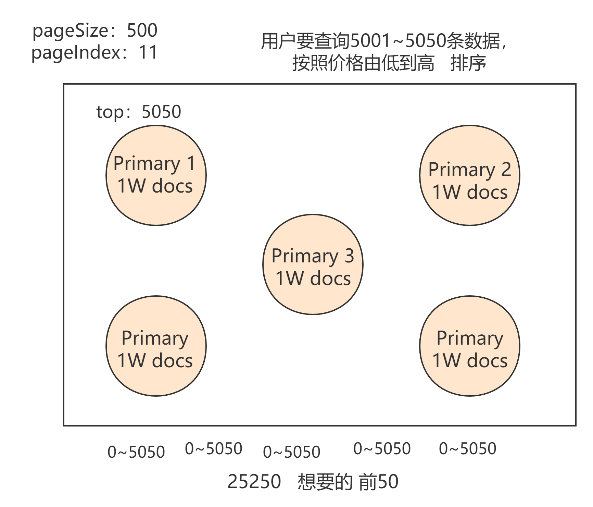

## 案例

### sql

```sql
CREATE TABLE IF NOT EXISTS `product` (
  `id` int(11) NOT NULL AUTO_INCREMENT,
  `name` varchar(50) COLLATE utf8mb4_unicode_ci DEFAULT NULL,
  `desc` varchar(300) COLLATE utf8mb4_unicode_ci DEFAULT NULL,
  `price` decimal(10,0) DEFAULT NULL,
  `tags` varchar(200) COLLATE utf8mb4_unicode_ci DEFAULT NULL,
  PRIMARY KEY (`id`)
) ENGINE=InnoDB AUTO_INCREMENT=6 DEFAULT CHARSET=utf8mb4 COLLATE=utf8mb4_unicode_ci;

-- Dumping data for table test_db.product: ~5 rows (大约)
/*!40000 ALTER TABLE `product` DISABLE KEYS */;
REPLACE INTO `product` (`id`, `name`, `desc`, `price`, `tags`) VALUES
	(1, 'xiaomi phone', 'shouji zhong de zhandouji', 13999, '"xingjiabi", "fashao","buka"'),
	(2, 'xiaomi nfc phone', 'zhichi quangongneng nfc,shouji zhong de jianjiji', 4999, '"xingjiabi", "fashao","gongjiaoka"'),
	(3, 'nfc phone', 'shouji zhong de hongzhaji ', 2999, '"xingjiabi", "fashao",\n"menjinka"'),
	(4, 'xiaomi erji', 'erji zhong de huangmenji', 999, '"low", "bufangshui","yinzhicha"'),
	(5, 'hongmi erji', 'erji zhong de kendeji nfc', 399, '"lowbee","xuhangduan",\n "zhiliangx"');
```

### 基本crud

```
（1）创建索引：PUT /product?pretty
（2）查询索引：GET _cat/indices?v
（3）删除索引：DELETE /product?pretty
（4）插入数据：
PUT /index/_doc/id
{
    Json数据
}
（5）更新数据
1)	全量替换
2)	指定字段更新
（6）删除数据	DELETE /index/type/id
```

数据

```shell
## 数据
PUT /product/_doc/1
{
    "name" : "xiaomi phone",
    "desc" :  "shouji zhong de zhandouji",
    "price" :  3999,
    "tags": [ "xingjiabi", "fashao", "buka" ]
}
PUT /product/_doc/2
{
    "name" : "xiaomi nfc phone",
    "desc" :  "zhichi quangongneng nfc,shouji zhong de jianjiji",
    "price" :  4999,
    "tags": [ "xingjiabi", "fashao", "gongjiaoka" ]
}


PUT /product/_doc/3
{
    "name" : "nfc phone",
    "desc" :  "shouji zhong de hongzhaji",
    "price" :  2999,
    "tags": [ "xingjiabi", "fashao", "menjinka" ]
}

PUT /product/_doc/4
{
    "name" : "xiaomi erji",
    "desc" :  "erji zhong de huangmenji",
    "price" :  999,
    "tags": [ "low", "bufangshui", "yinzhicha" ]
}

PUT /product/_doc/5
{
    "name" : "hongmi erji",
    "desc" :  "erji zhong de kendeji",
    "price" :  399,
    "tags": [ "lowbee", "xuhangduan", "zhiliangx" ]
}
```

### 查询操作

#### 超时

>(1)  设置：默认没有timeout，如果设置了timeout，那么会执行timeout机制。
>
>(2)  Timeout机制：假设用户查询结果有1W条数据，但是需要10″才能查询完毕，但是用户设置了1″的timeout，那么不管当前一共查询到了多少数据，都会在1″后ES讲停止查询，并返回当前数据。
>
>

```
Searchtimeout：
GET /_search?timeout=1s/ms/m
```

####        Query_string  

```
查询所有：
GET /product/_search
带参数：
GET /product/_search?q=name:xiaomi
分页：
GET /product/_search?from=0&size=2&sort=price:asc
```

Query dsl

#### match all

```
{
  "query":{
    "match_all": {}
  }
}
```

####        **match**  

>name 中nfc
>
>

```
GET /product/_search
{
  "query": {
    "match": {
      "name": "nfc"
    }
  }
}
```

#### sort

>price desc排序
>
>

```
GET /product/_search
{
  "query": {
    "multi_match": {
      "query": "nfc",
      "fields": ["name","desc"]
    }
  },
  "sort": [
    {
      "price": "desc"
    }
  ]
}
```

####        **multi_match**：根据多个字段查询一个关键词

>①  name和desc中包含“nfc”的doc

```
GET /product/_search
{
  "query": {
    "multi_match": {
      "query": "nfc",
      "fields": ["name","desc"]
    }
  },
  "sort": [
    {
      "price": "desc"
    }
  ]
}

```

#### source

>①  想要查询多个字段，例子中为只查询“name”和“price”字段。

```
GET /product/_search
{
  "query":{
    "match": {
      "name": "nfc"
    }
  },
  "_source": ["name","price"]
}

```

#### 分页

>​        **deep-paging）**：查询第一页（每页两条数据）  

```
GET /product/_search
{
  "query":{
    "match_all": {}
  },
  "sort": [
    {
      "price": "asc"
    }
  ], 
  "from": 0,
  "size": 2
}
```

### **全文检索**

**Full-text queries**  

####        **query-term**  

>①  **query-term**：不会被分词，

```shell
GET /product/_search
{
  "query": {
    "term": {
      "name": "nfc"
    }
  }
}
## 查不到数据
GET /product/_search
{
  "query": {
    "term": {
      "name": "nfc phone"
    }
  }
}
```

####        **match和term区别**  

```shell
GET /product/_search
{
  "query": {
    "term": {
      "name": "nfc phone" ##这里因为没有分词，所以查询没有结果
    }
  }
}
GET /product/_search
{
  "query": {
    "bool": {
      "must": [
        {"term":{"name":"nfc"}},
        {"term":{"name":"phone"}}
      ]
    }
  }
}
GET /product/_search
{
  "query": {
    "terms": {
      "name":["nfc","phone"]  ## 包含有nfc 或者phone
    }
  }
}
GET /product/_search
{
  "query": {
    "match": {
      "name": "nfc phone" 
    }
  }
}
```

#### ☆全文检索

```
GET /product/_search
{
  "query": {
    "match": {
      "name": "xiaomi nfc zhineng phone"
    }
  }
}
#验证分词
GET /_analyze
{
  "analyzer": "standard",
  "text":"xiaomi nfc zhineng phone"
}
```

###        Phrase search  

>(1)  短语搜索，和全文检索相反，“nfc phone”会作为一个短语去检索

```
GET /product/_search
{
  "query": {
    "match_phrase": {
      "name": "nfc phone"
    }
  }
}

```

###        Query and filter

```
filter 性能高,不会分数计算,可以提升性能
```


>①  bool：可以组合多个查询条件，bool查询也是采用more_matches_is_better的机制，因此满足must和should子句的文档将会合并起来计算分值。
>
>1)   must：必须满足
>
>子句（查询）必须出现在匹配的文档中，并将有助于得分。
>
>2)   filter：过滤器 不计算相关度分数，cache☆
>
>子句（查询）必须出现在匹配的文档中。但是不像 `must`查询的分数将被忽略。Filter子句在[filter上下文](https://www.elastic.co/guide/en/elasticsearch/reference/current/query-filter-context.html)中执行，这意味着计分被忽略，并且子句被考虑用于缓存。
>
>3)   should：可能满足 or
>
>子句（查询）应出现在匹配的文档中。
>
>4)   must_not：必须不满足 不计算相关度分数  not
>
>子句（查询）不得出现在匹配的文档中。子句在[过滤器上下文](https://www.elastic.co/guide/en/elasticsearch/reference/current/query-filter-context.html)中执行，这意味着计分被忽略，并且子句被视为用于缓存。由于忽略计分，`0`因此将返回所有文档的分数。
>
>5)   minimum_should_match

#### demo1

>\#首先筛选name包含“xiaomi phone”并且价格大于1999的数据（不排序），
>
>\#然后搜索name包含“xiaomi”and desc 包含“shouji”

```shell
GET /product/_search
{
  "query": {
    "bool":{
      "must": [
        {"match": { "name": "xiaomi"}},
        {"match": {"desc": "shouji"}}
      ],
      "filter": [
        {"match_phrase":{"name":"xiaomi phone"}},
        {"range": {
          "price": {
            "gt": 1999
          }
        }}
      ]
    }
  }
}
```

#### demo2

>bool多条件 name包含xiaomi 不包含erji 描述里包不包含  

```shell
GET /product/_search
{
  "query": {
"bool":{
 #name中必须包含“xiaomi”
      "must": [
        {"match": { "name": "xiaomi"}}
      ],
#name中必须不能包含“erji”
      "must_not": [
        {"match": { "name": "erji"}}
      ],
#should中至少满足0个条件，参见下面的minimum_should_match的解释
      "should": [
        {"match": {
          "desc": "nfc"
        }}
      ], 
#筛选价格大于4999的doc
      "filter": [		
        {"range": {
          "price": {
            "gt": 4999   
          }
        }}
      ]
    }
  }
}

```

#### 嵌套查询

>**1)**  **minimum_should_match****：参数指定should返回的文档必须匹配的子句的数量或百分比。如果bool查询包含至少一个should子句，而没有must或 filter子句，则默认值为1。否则，默认值为0**

```shell
GET /product/_search
{
  "query": {
    "bool":{
      "must": [
        {"match": { "name": "nfc"}}
      ],
      "should": [
        {"range": {
          "price": {"gt":1999}
        }},
         {"range": {
          "price": {"gt":3999}
        }}
      ],
      "minimum_should_match": 1
    }
  }
}

GET /product/_search
{
  "query": {
    "bool": {
      "filter": {
        "bool": {
          "should": [
            { "range": {"price": {"gt": 1999}}},
            { "range": {"price": {"gt": 3999}}}
          ],
          "must": [
            { "match": {"name": "nfc"}}
          ]
        }
      }
    }
  }
}

```

###  [Compound queries](https://www.elastic.co/guide/en/elasticsearch/reference/current/compound-queries.html)：组合查询

>①  想要一台带NFC功能的 或者 小米的手机 但是不要耳机
>
>**SELECT** * **from** product 
>
>**where** (`name` **like** "%xiaomi%" **or** `name` **like** '%nfc%')
>
>**AND** `name` **not** **LIKE** '%erji%'

```shell
GET /product/_search
{
  "query": {
    "constant_score":{
      "filter": {
        "bool": {
          "should":[
            {"term":{"name":"xiaomi"}},
            {"term":{"name":"nfc"}}
            ],
          "must_not":[
            {"term":{"name":"erji"}}
            ]
        }
      },
      "boost": 1.2
    }
  }
}
```

>①  搜索一台xiaomi nfc phone或者一台满足 是一台手机 并且 价格小于等于2999
>
>**SELECT** * **FROM** product 
>
>**WHERE** **NAME** **LIKE** '%xiaomi nfc phone%' 
>
>**OR** (
>
>**NAME** **LIKE** '%erji%' 
>
>**AND** price > 399 
>
>**AND** price <=999);

```shell
GET /product/_search
{
  "query": {
    "constant_score": {
      "filter": { 
        "bool":{
          "should":[
            {"match_phrase":{"name":"xiaomi nfc phone"}},
            {
              "bool":{
                "must":[
                  {"term":{"name":"phone"}},
                  {"range":{"price":{"lte":"2999"}}}
                  ]
              }
            }
          ]
        }
      }
    }
  }
}
```

### 高亮

```
(7)	Highlight search：
GET /product/_search
{
    "query" : {
        "match_phrase" : {
            "name" : "nfc phone"
        }
    },
    "highlight":{
      "fields":{
         "name":{}
      }
    }
}
```

### deep paging



>(1)  解释：当你的数据超过1W，不要使用
>
>(2)  返回结果不要超过1000个，500以下为宜
>
>(3)  解决办法：
>
>①  尽量避免深度分页查询
>
>②  使用Scroll search（只能下一页，没办法上一页，不适合实时查询）