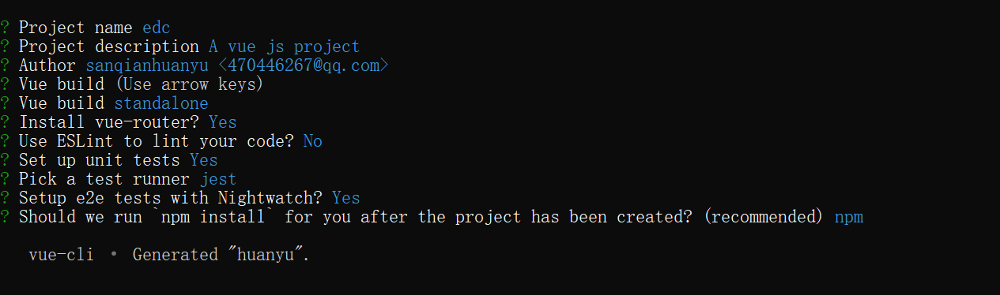

### 搭建Vue+Element UI

### 前期准备

```
1.打开cmd命令行，输入 node -v 和 npm -v，node安装后将会自动安装上npm，但不一定是最新的，可用命令 npm install -g npm，进行版本更新。
2.全局安装vue-cli脚手架工具：打开cmd命令行，输入npm install --global vue-cli。如果安装不成功，请检查npm是否最新版本，或cmd是否以管理员身份运行。
3.初始化项目：在命令行中，进入指定路径，运行 vue init webpack 项目名称，例如： vue init webpack myproject。
4.安装UI框架：在命令行中，进入项目路径myproject，运行npm i element-ui -S
```



* 学习地址

[https://element.eleme.cn/#/zh-CN](https://element.eleme.cn/#/zh-CN)

### 创建项目

